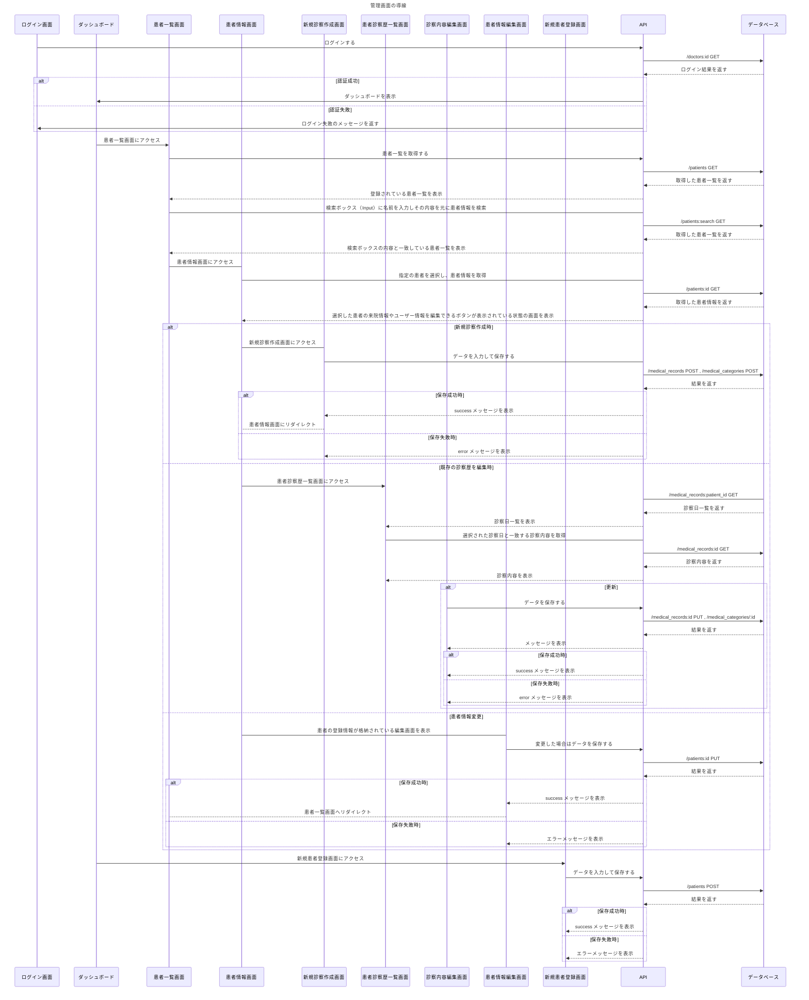

```mermaid
---
title: 管理画面の導線
---
sequenceDiagram
    participant ログイン画面
    participant ダッシュボード
    participant 患者一覧画面
    participant 患者情報画面
    participant 新規診察作成画面
    participant 患者診察歴一覧画面
    participant 診察内容編集画面
    participant 患者情報編集画面
    participant 新規患者登録画面
    participant API
    participant データベース
   
    ログイン画面->>API:ログインする
    API->>データベース:/doctors:id GET
    データベース-->>API:ログイン結果を返す

    alt 認証成功
        API->>ダッシュボード:ダッシュボードを表示
    else 認証失敗
        API->>ログイン画面:ログイン失敗のメッセージを返す
    end

    %% ダッシュボード->>新規診察作成画面:診察編集画面にアクセス
    %% 新規診察作成画面->>API:ボタンをクリックして患者一覧を取得
    %% API->>データベース:アクセス
    %% データベース-->>API:結果を返す
    %% API-->>患者一覧モーダル:登録されている患者一覧を表示
    %% 患者一覧モーダル->>新規診察作成画面:指定の患者を選択して診察編集画面に反映

    %% 新規診察作成画面->>API:データを入力して保存する
    %% API->>データベース:アクセス
    %% データベース-->>API:結果を返す
    %% API-->>新規診察作成画面:メッセージを表示
    
    %% 患者一覧取得
    ダッシュボード->>患者一覧画面:患者一覧画面にアクセス
    患者一覧画面->>API:患者一覧を取得する
    API->>データベース:/patients GET
    データベース-->>API:取得した患者一覧を返す
    API-->>患者一覧画面:登録されている患者一覧を表示

    患者一覧画面->API:検索ボックス（Input）に名前を入力しその内容を元に患者情報を検索
    API->>データベース:/patients:search GET
    データベース-->>API:取得した患者一覧を返す
    API-->>患者一覧画面:検索ボックスの内容と一致している患者一覧を表示

    %% 患者情報取得
    患者一覧画面->患者情報画面:患者情報画面にアクセス
    患者情報画面->API:指定の患者を選択し、患者情報を取得
    API->>データベース:/patients:id GET
    データベース-->>API:取得した患者情報を返す
    API-->>患者情報画面:選択した患者の来院情報やユーザー情報を編集できるボタンが表示されている状態の画面を表示

    alt 新規診察作成時
        患者情報画面->新規診察作成画面:新規診察作成画面にアクセス
        新規診察作成画面->API:データを入力して保存する
        API->>データベース:/medical_records POST , /medical_categories POST
        データベース-->>API:結果を返す
        alt 保存成功時
            API-->>新規診察作成画面:success メッセージを表示
            新規診察作成画面-->患者情報画面:患者情報画面にリダイレクト
        else 保存失敗時
            API-->>新規診察作成画面:error メッセージを表示
        end
    else 既存の診察歴を編集時
        患者情報画面->>患者診察歴一覧画面:患者診察歴一覧画面にアクセス
        API->データベース:/medical_records:patient_id GET 
        データベース-->>API:診察日一覧を返す
        API-->>患者診察歴一覧画面:診察日一覧を表示

        患者診察歴一覧画面->API:選択された診察日と一致する診察内容を取得
        API->>データベース:/medical_records:id GET
        データベース-->>API:診察内容を返す
        API-->>患者診察歴一覧画面:診察内容を表示
        alt 更新
            診察内容編集画面->>API:データを保存する
            API->>データベース:/medical_records:id PUT , /medical_categories/:id 
            データベース-->>API:結果を返す
            API-->>診察内容編集画面:メッセージを表示
            alt 保存成功時
                API-->>診察内容編集画面:success メッセージを表示
            else 保存失敗時
                API-->>診察内容編集画面:error メッセージを表示
            end
        %% else 削除
        %%     診察内容編集画面->>API:データを削除
        %%     API->>データベース:アクセス
        %%     データベース-->>API:結果を返す
        %%     alt 削除成功時
        %%         API-->>患者診察歴一覧画面:DB内で削除フラグを有効にし、success メッセージを表示して患者診察歴一覧画面にリダイレクト
        %%     else 削除失敗時
        %%         API-->>患者診察歴一覧画面:エラーメッセージを表示し患者診察歴一覧画面にリダイレクト
        %%     end
        end
    else 患者情報変更
        患者情報画面->患者情報編集画面:患者の登録情報が格納されている編集画面を表示
        患者情報編集画面->>API:変更した場合はデータを保存する
        API->>データベース:/patients:id PUT
        データベース-->>API:結果を返す
        alt 保存成功時
            API-->>患者情報編集画面:success メッセージを表示
            患者情報編集画面-->患者一覧画面:患者一覧画面へリダイレクト
        else 保存失敗時
            API-->>患者情報編集画面:エラーメッセージを表示
        end
    end

    %% 新規患者作成時
    ダッシュボード->>新規患者登録画面:新規患者登録画面にアクセス
    新規患者登録画面->>API:データを入力して保存する
    API->>データベース:/patients POST
    データベース-->>API:結果を返す
    alt 保存成功時
        API-->>新規患者登録画面:success メッセージを表示
    else 保存失敗時
        API-->>新規患者登録画面:エラーメッセージを表示
    end
```
