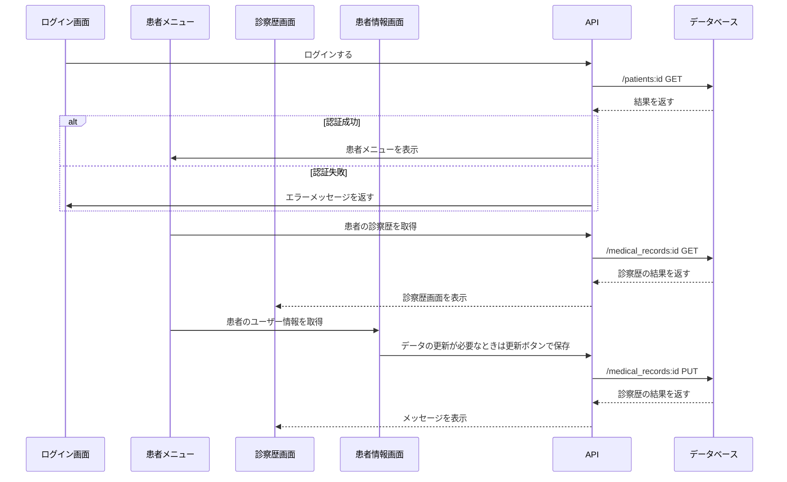

```mermaid
---
title:フロント画面の導線
---
sequenceDiagram
    participant ログイン画面
    participant 患者メニュー
    participant 診察歴画面
    participant 患者情報画面
    participant API
    participant データベース
    ログイン画面->>API:ログインする
    API->>データベース:/patients:id GET
    データベース-->>API:結果を返す

     alt 認証成功
        API->>患者メニュー:患者メニューを表示
    else 認証失敗
        API->>ログイン画面:エラーメッセージを返す
    end

    患者メニュー->>API:患者の診察歴を取得
    API->>データベース:/medical_records:id GET
    データベース-->>API:診察歴の結果を返す
    API-->>診察歴画面:診察歴画面を表示

    患者メニュー->>患者情報画面:患者のユーザー情報を取得
    患者情報画面->>API:データの更新が必要なときは更新ボタンで保存
    API->>データベース:/medical_records:id PUT
    データベース-->>API:診察歴の結果を返す
    API-->>診察歴画面:メッセージを表示
```
